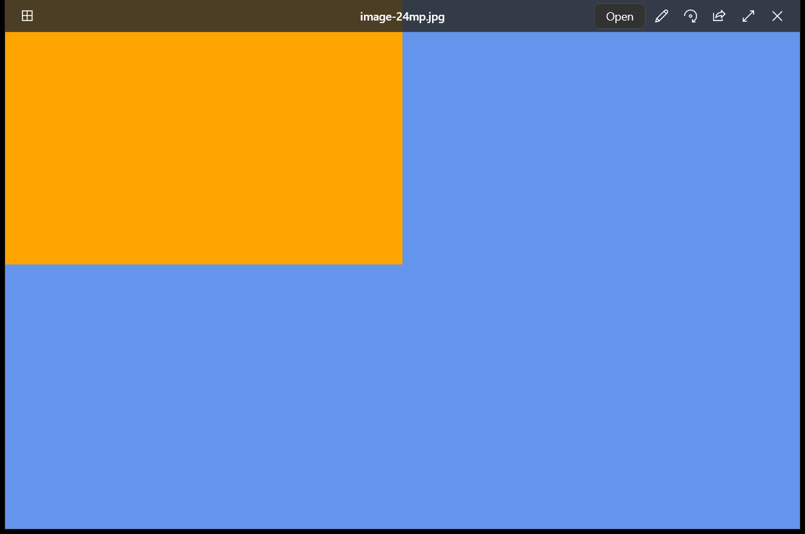
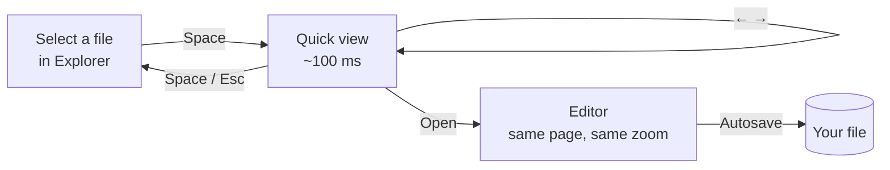
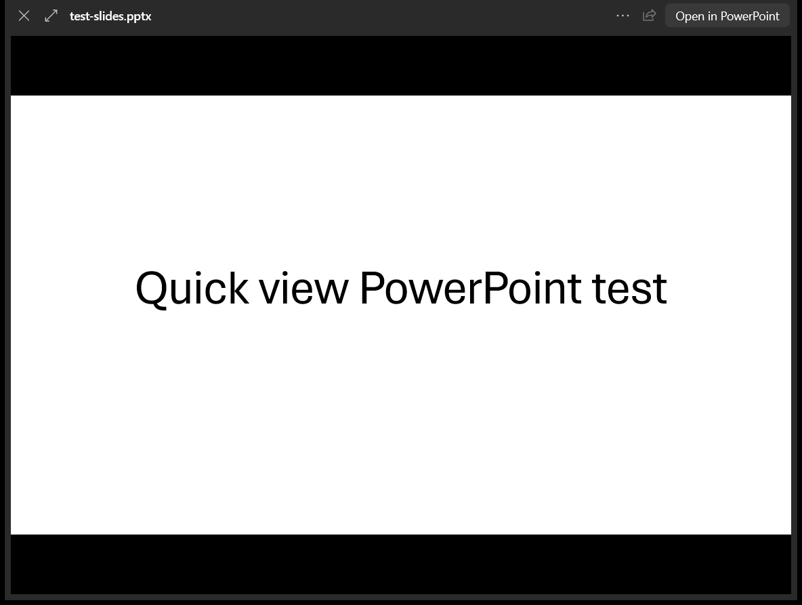
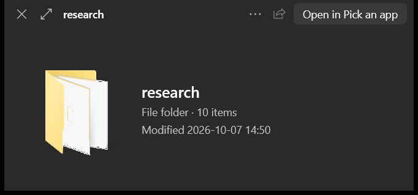
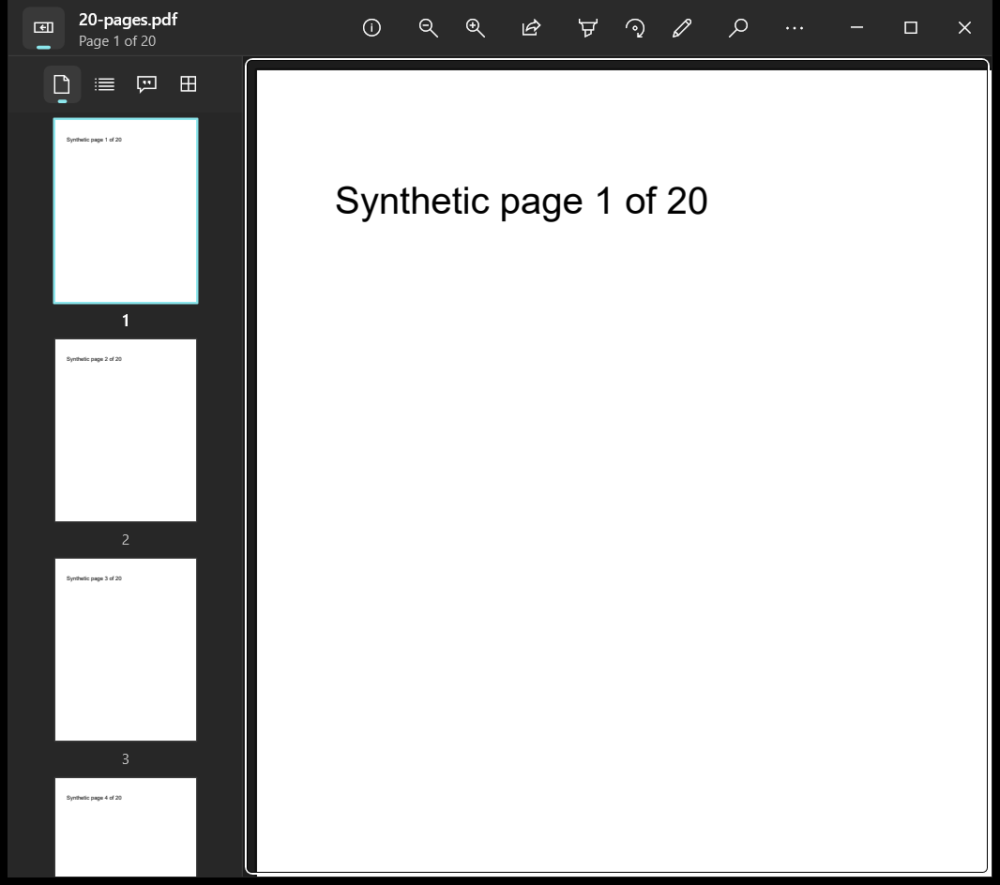
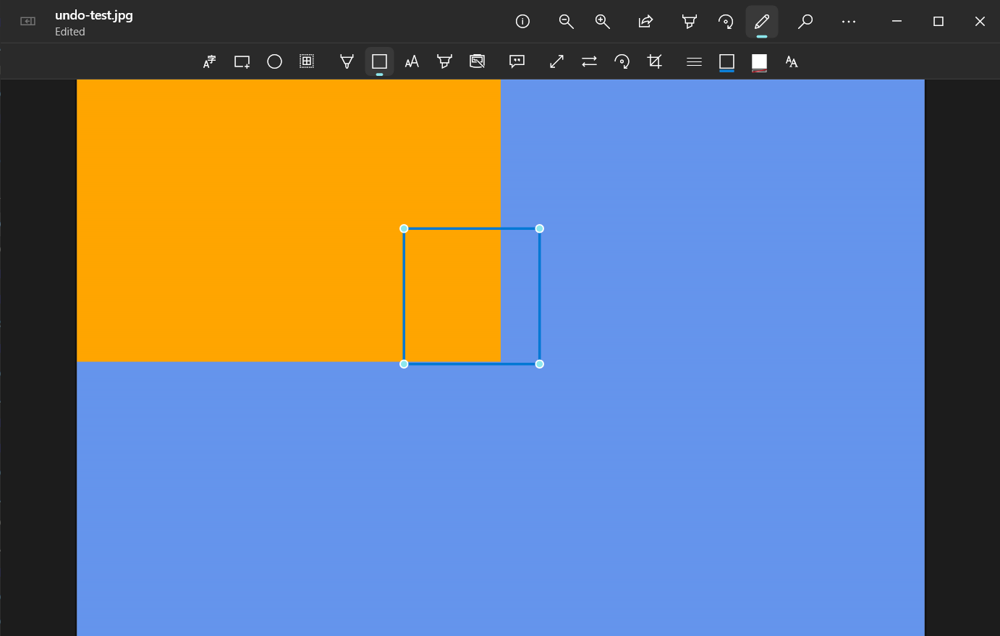
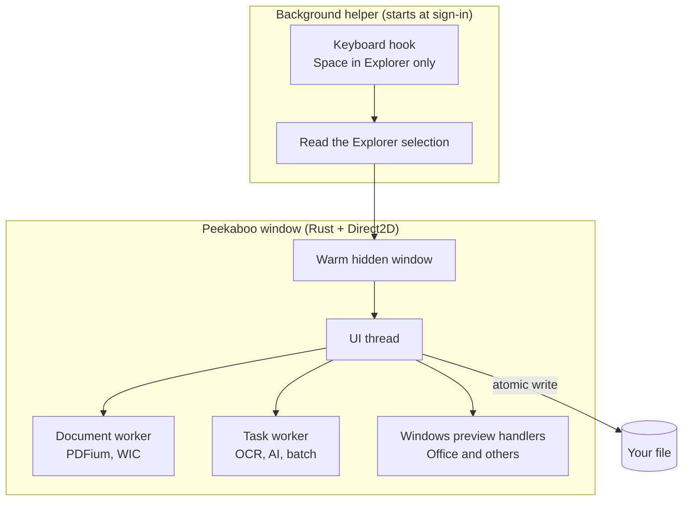

<div align="center">

# Peekaboo

**Press Space. See the file.**

A fast, native file previewer and PDF and image editor for Windows, inspired by the macOS Quick Look and Preview workflow.

Select any file in Explorer and press <kbd>Space</kbd>. It opens in about 100 ms. Press <kbd>Space</kbd> again to close it.




</div>

## Why it exists

On a Mac, you press Space to look at any file. On Windows, you pick an app and wait, and small edits are spread across Edge, Photos, Paint, and heavy PDF suites. Peekaboo makes looking instant and lets you finish the small edit in the same window.

**Read the product case study:** [problem, users, the pivot to Space-first, trade-offs, metrics, and what I cut →](docs/CASE-STUDY.md)

## How it works



| Step | What you do | What happens |
| --- | --- | --- |
| 1 | Select a file and press <kbd>Space</kbd> | A borderless preview grows out of the file's icon |
| 2 | Press <kbd>←</kbd> <kbd>→</kbd> | Step through the other files in the folder |
| 3 | Click **Open** | The same window becomes the editor |
| 4 | Edit | Changes save into the file. **Revert to opened** undoes all of them |

## Previews almost anything

<table>
<tr>
<td width="50%"></td>
<td width="50%"></td>
</tr>
<tr>
<td align="center">Office files use the preview Windows already has</td>
<td align="center">Folders and unknown types get an info card</td>
</tr>
</table>

| File type | Shown as |
| --- | --- |
| PDF | Pages, with a thumbnail rail for multi-page files |
| JPEG, PNG, WebP, TIFF, GIF, BMP, HEIC* | Full image, sized to fit |
| Word, Excel, PowerPoint, video, and more | The Windows preview handler for that type |
| Text, Markdown, CSV, JSON, code | Scrollable text |
| Folders and everything else | Icon, kind, size, and date |

\*HEIC needs the HEIF extension from the Microsoft Store.

## The editor



| Area | You can |
| --- | --- |
| **Read** | Scroll, zoom, find text (<kbd>Ctrl</kbd>+<kbd>F</kbd>), and select and copy text, including text in images (offline) |
| **Mark up** | Highlight, underline, strike out, draw, add shapes, arrows, text boxes, and notes |
| **Sign and fill** | Draw a signature once and place it in 2 clicks. Type into PDF form fields |
| **Pages** | Drag to reorder, rotate, delete, insert, merge, and drag a page out to Explorer |
| **Images** | Crop, resize, flip, convert with a quality slider, batch convert, and remove backgrounds |



## Keyboard

| Quick view | | Editor | |
| --- | --- | --- | --- |
| Open or close | <kbd>Space</kbd> | Open | <kbd>Ctrl</kbd>+<kbd>O</kbd> |
| Close | <kbd>Esc</kbd> | Find | <kbd>Ctrl</kbd>+<kbd>F</kbd> |
| Next or previous file | <kbd>←</kbd> <kbd>→</kbd> | Markup bar | <kbd>Ctrl</kbd>+<kbd>Shift</kbd>+<kbd>A</kbd> |
| Open in the editor | <kbd>Enter</kbd> | Undo | <kbd>Ctrl</kbd>+<kbd>Z</kbd> |
| All selected files | <kbd>Ctrl</kbd>+<kbd>Enter</kbd> | Actual size or fit | <kbd>Ctrl</kbd>+<kbd>0</kbd> or <kbd>Ctrl</kbd>+<kbd>9</kbd> |
| Full screen | <kbd>F11</kbd> | Rotate | <kbd>Ctrl</kbd>+<kbd>R</kbd> |
| Backup shortcut | <kbd>Ctrl</kbd>+<kbd>Shift</kbd>+<kbd>Space</kbd> | Sidebar views | <kbd>Ctrl</kbd>+<kbd>Shift</kbd>+<kbd>1</kbd>…<kbd>5</kbd> |

## Speed

Measured on the development PC (Intel i7-11800H, 32 GB, Windows 10). This is not the target low-end laptop.

| Measure | Result |
| --- | --- |
| Space to quick view, PDF or image | 79 to 210 ms |
| Space to quick view, Word, Excel, or PowerPoint | 72 to 124 ms |
| Cold launch to the first page of a 500-page PDF | 358 ms (p95 of 20 runs) |
| Background helper while idle | about 8 MB |

## Under the hood



- **Native.** Rust with Win32 and Direct2D. No Electron, no web view.
- **Private.** No account, no telemetry, and no network calls.
- **Safe saves.** Edits are kept as steps and written to a temp file, then swapped in. If another app changes the file, autosave pauses.

## Build

Needs Windows 10 or 11, Rust (stable), and the Visual Studio C++ build tools.

```powershell
powershell -File tools/fetch-pdfium.ps1      # PDF engine, into runtime/
cargo build --release
target\release\peekaboo.exe --resident       # start the Space helper
```

To test without the helper, open a file directly: `target\release\peekaboo.exe file.pdf`.

## Status

This is a development build. It is not signed and not yet on the Microsoft Store. See [docs/remaining-work.md](docs/remaining-work.md) for open items and [docs/quicklook-spec.md](docs/quicklook-spec.md) for the design.

Third-party components and their licenses: [THIRD-PARTY-NOTICES.md](THIRD-PARTY-NOTICES.md).
