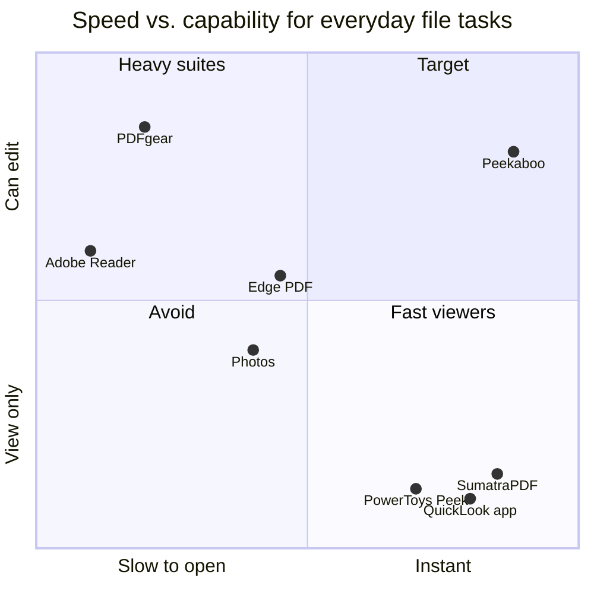

# Peekaboo: product case study

**One line:** On a Mac, you press Space to look at any file. On Windows, you open an app and wait. Peekaboo brings the Space-bar habit to Windows, then lets you finish the small edit in the same window.

| | |
| --- | --- |
| **Role** | Product owner: problem framing, PRD, scope, prioritization, design direction, acceptance. Built with AI coding agents that I directed and reviewed. |
| **Stage** | Working development build. Not yet tested with users or published to the Store. |
| **Artifacts** | [PRD](PRD.md) · [Design and parity spec](quicklook-spec.md) · [Research](research/SUMMARY.md) · [Decision log](../CLAUDE.md#decisions-log) |

---

## 1. Problem

> "I got a PDF or a photo, and I need to do one small thing to it in the next 30 seconds."

On Windows, that job is spread across 4 apps, and none of them is both fast and complete.

| Today | Good at | Fails the user because |
| --- | --- | --- |
| Edge PDF reader | Reading, highlighting, forms | Opens a browser, can't reorder pages |
| Photos | Crop, rotate, background removal | No PDF, no batch convert |
| Paint, Snipping Tool | Quick markup | A different app for every step |
| PDF suites (PDFgear, PDF24) | Merge, split, sign | 100+ MB installs, heavy UI, paid tiers |

**The cost is time and attention, not money.** Each small task means: pick an app, wait for it, find the tool, save, check the result.

## 2. Who it is for

| Segment | Job to be done | What they feel today |
| --- | --- | --- |
| **Switchers from Mac** (primary) | "Glance at files as fast as I think." | Windows feels slow; they miss Space |
| **Office workers** | "Sign this PDF, fill this form, send it back." | Edge almost works, then fails on a form or page order |
| **Students** | "Merge my scans, compress, submit." | Upload to a random website and hope |

Assumption to validate: Mac switchers adopt first and tell others. I haven't run interviews yet, so this is a hypothesis.

## 3. The insight that changed the product

The first PRD was **editor-first**: a faster Preview app that you open.

When I compared the builds side by side with the real macOS flow, I saw that the editor is not the magic. **The magic is the Space bar.** Quick Look removes the decision "which app do I open?". You don't open anything; you just look.

**Windows today:** 4 steps, 3 to 10 s

**With Peekaboo:** 2 steps, about 0.1 s

So I pivoted the product to **Quick Look first** (decision D21):

1. **Space opens any file** in about 100 ms, in a bare window.
2. **Open** turns the same window into the editor, on the same page and zoom.
3. **The editor copies the Mac layout** that people already know, with no new learning.

## 4. Where it sits

Positions are my judgment from hands-on use and public specs, not measurements.

**The gap:** the fast tools only view, and the tools that edit are slow. Nobody owns "instant **and** can finish the job."

## 5. Key product decisions and trade-offs

| Decision | Chose | Gave up | Why |
| --- | --- | --- | --- |
| **Entry point** | Space in Explorer | A normal launch-first app | Removes the "which app?" decision. Speed is felt at the first moment |
| **Saving** | Mac-style autosave, with "Revert to opened" | A "Save?" prompt on every edit | Prompts are friction. Revert covers mistakes, and writes are atomic, so a crash can't corrupt the file |
| **Privacy** | No telemetry, no account, no network | Easy usage analytics | Trust is the product for a file tool. Metrics come from opt-in beta and usability tests instead |
| **Coverage** | Reuse the Windows preview handlers for Office and other files | Building our own renderer for each type | Day-one coverage of most file types at near-zero cost |
| **PDF engine** | PDFium (Apache 2.0) | MuPDF, which is faster but AGPL | The AGPL would force the whole app open source or a paid license |
| **AI background removal** | Small local model on the CPU | The best-quality models | The best models are trained on data that bans commercial use. Legal review still pending |
| **iPhone photos (HEIC)** | Use the Windows codec when installed | Bundling a decoder | Patent and license risk. A one-time prompt instead |
| **Stack** | Native Rust and Win32 | WinUI or Electron | Cold launch and memory are the promise. Electron ships a whole browser engine |

Every decision, with its source, is in the [decision log](../CLAUDE.md#decisions-log).

## 6. How I'd measure success

**North star:** the share of file opens that start with Space. It shows that the habit formed, not just that the app is installed.

| Type | Metric | Target | Today |
| --- | --- | --- | --- |
| Activation | Set as default viewer by day 7 | 50% of installs | Not measured yet (no users) |
| Habit | Opens via Space, per user per week | 10+ | Not measured yet |
| Speed (input) | Space to first frame, p95 | under 150 ms | **79 to 210 ms** ✅ mostly |
| Speed (input) | Cold launch, 500-page PDF, p95 | under 400 ms | **358 ms** ✅ |
| Guardrail | Background memory while idle | under 15 MB | **about 8 MB** ✅ |
| Guardrail | Crash-free sessions | 99.5% | Not measured. One crash was found and fixed in live testing |
| Task success | Top 10 tasks done without leaving the app | 90% in a 15-user test | Not tested yet |

Speed numbers are from my development PC (i7, 32 GB), not the target 8 GB laptop.

## 7. What I cut, and why

| Cut from v1 | Reason |
| --- | --- |
| Editing body text in PDFs | Mac Preview doesn't do it either. Large effort for a rare job |
| Redaction | A redaction that leaves hidden text is a data leak. It needs its own verified design |
| Cloud sync, accounts | Against the privacy promise, and no user asked for it |
| Mac and Linux builds | The problem only exists on Windows |

## 8. Risks I'm tracking

| Risk | Impact | Plan |
| --- | --- | --- |
| Space conflicts with other tools or typing | Users disable the app | Space works only when Explorer's file list has focus, never in a text box. Ctrl+Shift+Space as a backup |
| Antivirus flags the keyboard hook | Install blocked | Code signing and a Store listing before public release |
| Office previews hang | The window freezes | Previews run in a separate process. Add a timeout |
| "Preview"-like naming | Trademark trouble | Renamed to Peekaboo. Store and trademark search still to do |

## 9. Next experiments

1. **Five interviews with Mac switchers.** Validate the primary segment and the Space habit.
2. **Closed beta with 50 users and opt-in metrics.** Measure Space opens per week and the day-7 default-app rate.
3. **First-run test.** Does a 10-second "Press Space" hint lift activation more than a static screen does?
4. **Low-end laptop benchmark.** Confirm under 150 ms on an 8 GB machine.

## 10. What I learned

- **Benchmark against the experience, not the feature list.** The parity table in the spec was useful. Watching real Mac frames changed the product.
- **Speed is a feature you have to protect.** A launch-time benchmark with a regression gate exists, but it ran only twice. In the next phase it should run on every build.
- **Say no out loud.** Writing down non-goals and cuts kept a big scope shippable.
- **Live testing beats compiling.** A clean build hid a crash, a focus bug, and the "Space does nothing" issue. All 3 surfaced only when the app ran on screen.
